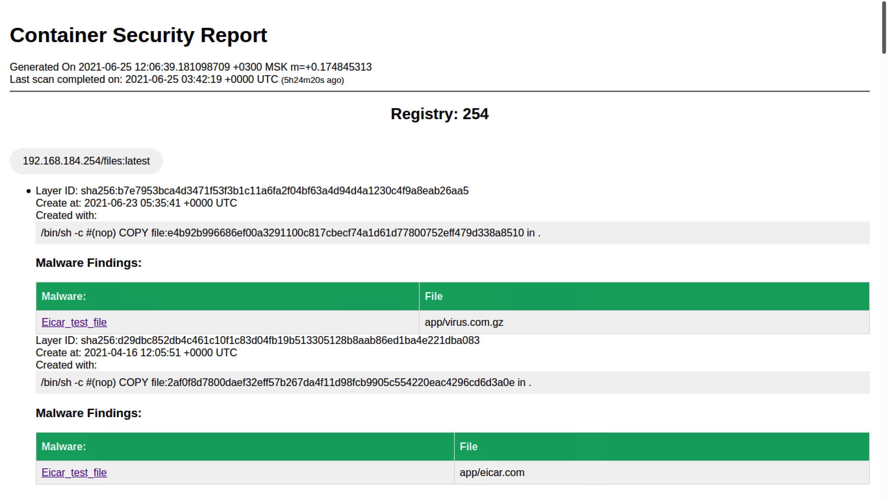

# Trend Micro Container Security/Smart Check Report Generator

Version 0.1
by Mikhail Kondrashin

[](https://opensource.org/licenses/Apache-2.0)

This utility provides ability to generate reports on last scan of two following products:
* [CloudOne Container Security](https://www.trendmicro.com/en_my/business/products/hybrid-cloud/cloud-one-container-image-security.html)
* [Deep Security Smart Check](https://deep-security.github.io/smartcheck-docs/admin_docs/admin.html)

cs-report generates reports in HTML format.

**Note:** cs-report does not initiate registry scans. It uses last scan result.

Usage of cs-report:
```
 -url string
    	Smart Check/Container Security URL (i.e. https://10.1.1.10:31616)
 -user string
    	User name (default "administrator")  
 -password string
    	Password
 -ignore_tls
    	Ignore TLS Errors when connecting to Smart Check/Container Security
```

After execution cs-report generates report into filename of following format:
```
report_YYYYMMDD.html
```

## Report Example


